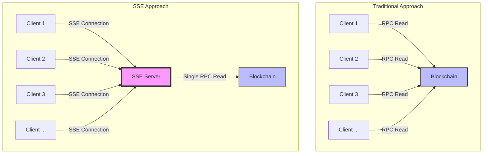

# Scaling RPC Reads

This project demonstrates a Server-Sent Events (SSE) based system for scaling blockchain RPC read operations. It simulates price updates with network latency and provides a load testing script for performance evaluation.

## Why Use This Pattern?

This project demonstrates a pattern for scaling blockchain RPC read operations using Server-Sent Events (SSE). Here's why this approach is beneficial compared to having each client read directly from the blockchain:

1. **Reduced Network Load**: Instead of every client making individual RPC calls to the blockchain, a single server acts as an intermediary. This significantly reduces the number of direct blockchain queries, lowering network congestion and potential costs associated with RPC calls.

2. **Improved Scalability**: As the number of clients increases, the load on the blockchain node remains constant. The server can handle thousands of client connections while maintaining a single connection to the blockchain, allowing for better scalability.

3. **Lower Latency**: The server can cache recent data and serve it to clients instantly, reducing the overall latency compared to each client making separate blockchain calls.

4. **Consistent Updates**: All clients receive updates simultaneously, ensuring consistency across the application ecosystem.

5. **Bandwidth Efficiency**: SSE allows for efficient, unidirectional data streaming from server to clients, reducing overall bandwidth usage compared to polling or WebSocket solutions.

6. **Reduced Client Complexity**: Clients don't need to implement blockchain connection logic or handle RPC call rate limiting, simplifying client-side code.

7. **Enhanced Monitoring and Control**: Centralizing blockchain reads allows for better monitoring of data access patterns and the ability to implement rate limiting or access controls if needed.

8. **Cost Reduction**: For blockchain networks that charge for RPC calls, this pattern can significantly reduce operational costs by minimizing the total number of calls made.

9. **Improved Reliability**: The server can implement advanced error handling and retry mechanisms for blockchain interactions, providing a more reliable data stream to clients.

10. **Flexibility for Future Enhancements**: This architecture allows for easy integration of additional features like data aggregation, formatting, or filtering at the server level, benefiting all connected clients.

By implementing this pattern, you can create more efficient, scalable, and cost-effective blockchain-based applications that provide real-time data to a large number of clients without overwhelming the blockchain network.

## Architecture Diagram

The following diagram illustrates the difference between the traditional approach of multiple clients reading from the blockchain and our SSE-based approach:



## Features

- Fastify server with SSE endpoint for price updates
- Simulated blockchain price generation
- Network latency simulation
- Concurrent connection tracking
- TypeScript-based load testing script

## Prerequisites

- Node.js (v20.14.11 or later recommended)
- npm or pnpm

## Setup

1. Clone this repository:
   ```
   git clone <repository-url>
   cd scaling-rpc-reads
   ```

2. Install dependencies:
   ```
   npm install
   ```
   or if using pnpm:
   ```
   pnpm install
   ```

## Running the Server

1. For development with watch mode:
   ```
   npm run dev
   ```

2. For production:
   ```
   npm start
   ```

The server will start and run the compiled `index.js` file.

## Running the Load Test

To run the load test:
```
npm run loadtest
```

This will execute the load test script located at `loadtest/loadtest.ts`.

## Scripts

- `dev`: `tsx watch src/index.ts` - Runs the server in development mode with auto-reloading
- `start`: `tsx src/index.ts` - Starts the server for production
- `loadtest`: `tsx loadtest/loadtest.ts` - Runs the load test script

## Configuration

You can modify the following files to adjust the behavior:

### Server (`src/index.ts`)

- Adjust network latency and price update intervals as needed

### Load Test (`loadtest/loadtest.ts`)

- Modify the number of concurrent connections and test duration

## Endpoints

- `/price-updates`: SSE endpoint for receiving price updates
- `/client-count`: GET endpoint to retrieve the current number of connected clients (if implemented)


## Contributing

Contributions are welcome! Please feel free to submit a Pull Request.