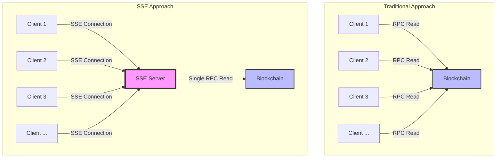
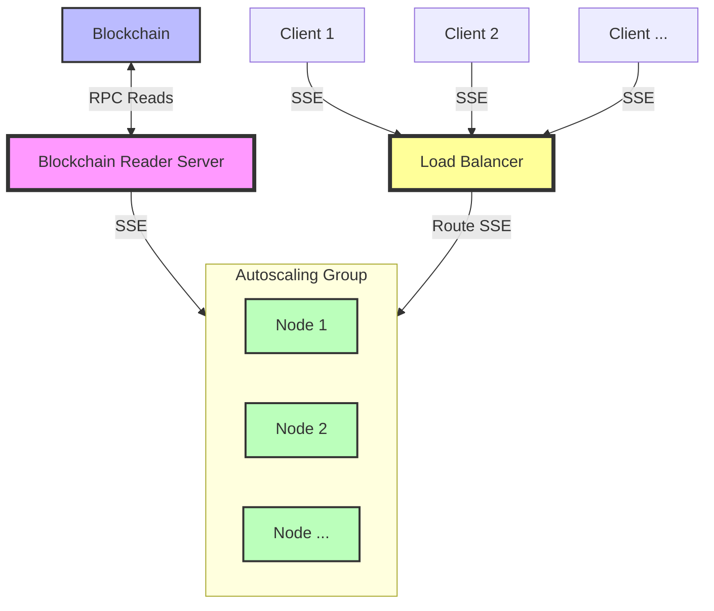

# Scaling RPC Reads

This project demonstrates a Server-Sent Events (SSE) based system for scaling blockchain RPC read operations. It simulates price updates with network latency and provides a load testing script for performance evaluation.

## Why Use This Pattern?

This project demonstrates a pattern for scaling blockchain RPC read operations using Server-Sent Events (SSE). It's important to note that this approach is not a one-size-fits-all solution for all blockchain reads, but rather it excels in specific scenarios:

### Ideal Use Cases

This pattern is particularly effective for:

1. **Frequently Requested, Shared Data**: When many clients need the same piece of information, such as:
   - The current price of an asset
   - The total supply of a token
   - The current gas price
   - The latest block number

2. **High-Frequency Updates**: Data that changes often and needs to be continuously monitored by multiple clients.

3. **Read-Only Operations**: Operations that don't require writing to the blockchain or executing transactions.

In these scenarios, the benefits of this pattern include:

1. **Reduced Network Load**: Instead of every client making individual RPC calls to the blockchain for the same data, a single server acts as an intermediary. This significantly reduces the number of direct blockchain queries, lowering network congestion and potential costs associated with RPC calls.

2. **Improved Scalability**: As the number of clients increases, the load on the blockchain node remains constant. The server can handle thousands of client connections while maintaining a single connection to the blockchain, allowing for better scalability.

3. **Lower Latency**: The server can cache recent data and serve it to clients instantly, reducing the overall latency compared to each client making separate blockchain calls.

4. **Consistent Updates**: All clients receive updates simultaneously, ensuring consistency across the application ecosystem.

5. **Bandwidth Efficiency**: SSE allows for efficient, unidirectional data streaming from server to clients, reducing overall bandwidth usage compared to polling or WebSocket solutions.

### When to Use Direct Blockchain Reads

While this pattern is powerful for shared, frequently-updated data, there are scenarios where direct blockchain reads are still preferable:

1. **User-Specific Data**: When clients need to read data specific to their account or transactions.
2. **Infrequent Queries**: For data that is rarely accessed or doesn't change often.
3. **Complex Queries**: Operations that require complex smart contract interactions or data aggregation from multiple sources.
4. **Write Operations**: Any operation that needs to modify the blockchain state.
5. **Privacy-Sensitive Information**: When the data being queried is sensitive and shouldn't be broadcast to all clients.

By implementing this pattern for appropriate use cases, you can create more efficient, scalable, and cost-effective blockchain-based applications that provide real-time data to a large number of clients without overwhelming the blockchain network.

## Architecture Diagram

The following diagram illustrates the difference between the traditional approach of multiple clients reading from the blockchain and our SSE-based approach:



### Scalable design



This scaling architecture efficiently distributes blockchain data to multiple clients while minimizing blockchain load. Here's how it works:

1. A single Blockchain Reader Server connects to the blockchain, making RPC calls to fetch the latest data (e.g., asset prices).

2. The Reader Server broadcasts updates via Server-Sent Events (SSE) to an Autoscaling Group of nodes.

3. As client demand increases, the Autoscaling Group automatically adds more nodes to handle the load.

4. A Load Balancer sits in front of the Autoscaling Group, evenly distributing incoming client connections across all available nodes.

5. Clients connect to the Load Balancer using SSE, receiving real-time updates from the assigned node in the Autoscaling Group.

This design allows the system to handle a growing number of clients without increasing the load on the blockchain. It maintains a single source of truth (the Blockchain Reader Server) while enabling horizontal scaling of the data distribution layer (the Autoscaling Group).

## Features

- Fastify server with SSE endpoint for price updates
- Simulated blockchain price generation
- Network latency simulation
- Concurrent connection tracking
- TypeScript-based load testing script

## Prerequisites

- Node.js (v20.14.11 or later recommended)
- npm or pnpm

## Setup

1. Clone this repository:
   ```
   git clone <repository-url>
   cd scaling-rpc-reads
   ```

2. Install dependencies:
   ```
   npm install
   ```
   or if using pnpm:
   ```
   pnpm install
   ```

## Running the Server

1. For development with watch mode:
   ```
   npm run dev
   ```

2. For production:
   ```
   npm start
   ```

The server will start and run the compiled `index.js` file.
You can open the index.html file in a browser to see the price updates in real-time.

## Running the Load Test

To run the load test:
```
npm run loadtest
```

This will execute the load test script located at `loadtest/loadtest.ts`.

## Scripts

- `dev`: `tsx watch src/index.ts` - Runs the server in development mode with auto-reloading
- `start`: `tsx src/index.ts` - Starts the server for production
- `loadtest`: `tsx loadtest/loadtest.ts` - Runs the load test script

## Configuration

You can modify the following files to adjust the behavior:

### Server (`src/index.ts`)

- Adjust network latency and price update intervals as needed

### Load Test (`loadtest/loadtest.ts`)

- Modify the number of concurrent connections and test duration

## Endpoints

- `/price-updates`: SSE endpoint for receiving price updates
- `/client-count`: GET endpoint to retrieve the current number of connected clients (if implemented)


## Contributing

Contributions are welcome! Please feel free to submit a Pull Request.